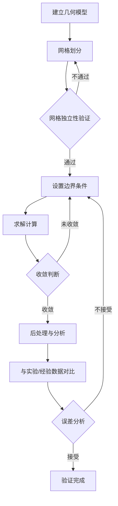

# CFD 流量验证

进行中

## 验证目标

CFD流量验证的核心目标是确保SCR系统内部流场满足设计要求，为脱硝效率提供流场基础保障。

## 关键验证指标

### 1. 速度均匀性

催化剂入口截面速度均匀性指数 (Uniformity Index, UI)：

$$
UI = 1 - \frac{1}{2}\frac{\sum|v_i - \bar{v}|A_i}{\bar{v}\sum A_i}
$$

一般要求 **UI ≥ 0.85**，优秀水平应达到 **UI ≥ 0.90**。

### 2. 氨氮摩尔比分布

$$
M_{NH_3/NO_x} = \frac{C_{NH_3}}{C_{NO_x}}
$$

目标：截面 NH3/NOx 摩尔比偏差 ≤ ±5%。

### 3. 温度均匀性

催化剂入口截面温度分布标准差：

$$
\sigma_T = \sqrt{\frac{1}{n}\sum(T_i - \bar{T})^2}
$$

## 网格独立性验证

采用 Richardson 外推法进行网格独立性验证：

| 网格等级 | 网格数量 | 归一化尺寸 | 目标参数 (UI) |
|---------|---------|-----------|-------------|
| 粗网格 | ~200万 | 1.0 | - |
| 中网格 | ~500万 | 0.7 | - |
| 细网格 | ~1200万 | 0.5 | - |

**收敛标准**: GCI (Grid Convergence Index) ≤ 3%

## 验证流程

## 湍流模型验证

### 模型比较

| 模型 | 特点 | 适用场景 |
|------|------|---------|
| Realizable k-ε | 旋转修正、分离流精度好 | 主流区、射流 |
| SST k-ω | 近壁面精度高 | 边界层、分离区 |
| RSM | 各向异性湍流 | 强旋流场合 |

**推荐**: 对于SCR系统，采用 **SST k-ω** 或 **Realizable k-ε + 增强壁面处理**。

## 验证数据记录模板

| 工况 | 入口速度 (m/s) | 尿素喷射量 (kg/h) | 温度 (K) | UI | 压降 (Pa) |
|------|---------------|------------------|---------|-----|----------|
| Case-01 | - | - | - | - | - |
| Case-02 | - | - | - | - | - |
