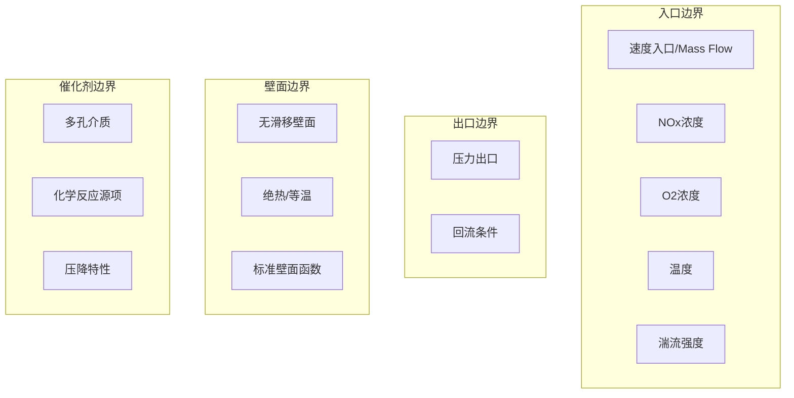

# 参数准备

准备中

## SCR CFD 模拟关键参数清单

### 一、几何参数

| 参数 | 说明 | 备注 |
|------|------|------|
| 喉道截面积 | 临界流计算关键参数 | 实测值优先 |
| 催化剂层尺寸 | 长×宽×厚度 | 厂家提供 |
| 混合段长度 | 尿素喷射点到催化剂入口 | 影响蒸发完成度 |
| 管道直径 | 进出口管径 | 设计图纸 |

### 二、物性参数

#### 烟气物性

| 参数 | 典型值 | 单位 |
|------|--------|------|
| 密度 | 0.5 ~ 0.8 | kg/m³ |
| 动力粘度 | 3.0×10⁻⁵ ~ 4.5×10⁻⁵ | Pa·s |
| 比热容 | 1100 ~ 1200 | J/(kg·K) |
| 导热系数 | 0.04 ~ 0.07 | W/(m·K) |

#### 尿素溶液 (32.5% wt)

| 参数 | 值 | 单位 |
|------|-----|------|
| 密度 | 1090 | kg/m³ |
| 表面张力 | 0.065 | N/m |
| 粘度 | 1.2×10⁻³ | Pa·s |
| 饱和蒸气压 | 随温度变化 | Pa |

### 三、喷射参数

| 参数 | 说明 | 设置依据 |
|------|------|---------|
| 喷射量 | 根据NSR和目标NOx转化率 | 化学计量计算 |
| 喷射压力 | 气助式: 3~5 bar | 喷嘴特性曲线 |
| SMD | 索特平均直径 | 雾化实验/经验公式 |
| 喷雾锥角 | 全锥角 | 喷嘴设计参数 |
| 喷射方向 | 顺流/逆流 | 混合效率优化 |

### 四、反应参数

#### SCR反应动力学

标准SCR反应（主反应）：

$$
4NH_3 + 4NO + O_2 \rightarrow 4N_2 + 6H_2O
$$

快速SCR反应：

$$
2NH_3 + NO + NO_2 \rightarrow 2N_2 + 3H_2O
$$

#### Arrhenius 参数

| 反应 | 指前因子 A | 活化能 Ea (kJ/mol) |
|------|-----------|-------------------|
| 标准SCR | 由催化剂定 | ~60 ~ 85 |
| 快速SCR | 由催化剂定 | ~30 ~ 50 |
| NH3氧化 | 由催化剂定 | ~100 ~ 150 |

### 五、边界条件汇总

## 检查清单

- [ ] 网格独立性验证通过
- [ ] 物性参数来源确认
- [ ] 喷嘴雾化参数标定
- [ ] 反应动力学参数校对
- [ ] 边界条件一致性检查
- [ ] 收敛标准设定
