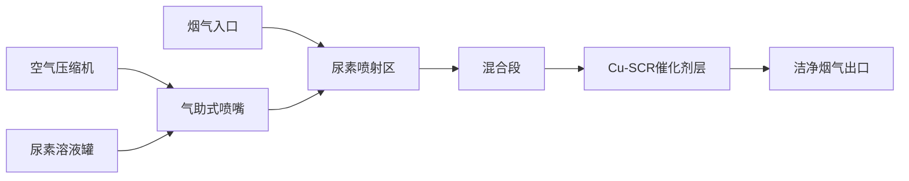

# SCR_NZ001 项目概述

进行中 CFD流量验证

## 项目背景

**SCR_NZ001** 是针对固定式工业SCR（选择性催化还原）脱硝系统开展的CFD分析项目。项目目标是通过计算流体力学方法，精确验证SCR系统内部流场特性，为系统设计优化提供理论依据和数据支持。

## 系统构成

## 技术路线

### 1. CFD建模

| 项目 | 参数设置 |
|------|---------|
| 求解器类型 | 稳态/瞬态压力基求解器 |
| 湍流模型 | Realizable k-ε / SST k-ω |
| 多相流模型 | 欧拉-拉格朗日 (DPM) |
| 化学反应 | SCR脱硝反应动力学 |
| 网格类型 | 结构化/非结构化混合网格 |
| 网格数量 | ~500万 ~ 2000万 |

### 2. 边界条件

- **入口**: 速度入口 / 质量流量入口
- **出口**: 压力出口
- **壁面**: 无滑移壁面（标准壁面函数）
- **催化剂层**: 多孔介质模型 + 化学反应源项

### 3. 验证指标

1. 催化剂入口截面速度均匀性指数 (UI)
2. NH3/NOx 摩尔比分布均匀性
3. 催化剂层温度分布均匀性
4. 系统总压降
5. 尿素液滴蒸发完成率

## 当前阶段

当前处于 **CFD流量验证参数准备阶段**，重点推进：

- 喉道临界流 参数确定与边界条件设置
- 气液两相雾化模拟 关键参数标定
- 尿素喷射位置 优化与冷区评估

## 参考文献

1. SCR DeNOx system CFD modeling guidelines
2. ANSYS Fluent Theory Guide - Multiphase Flows
3. Cu-SCR catalyst reaction kinetics
