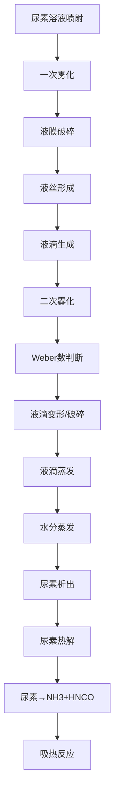

# 气液两相雾化模拟

<span class="tag tag-orange">关键研究</span>

## 研究背景

尿素溶液（AdBlue/DEF, 32.5% wt）经气助式喷嘴喷入高温烟气后，经历液滴雾化、蒸发、尿素热解三个连续过程。准确模拟这一气液两相过程是SCR CFD分析的核心难点。

## 物理过程



## 模型选择

### 一、液滴破碎模型

| 模型 | 适用条件 | 特点 |
|------|---------|------|
| TAB | 低We数 (<100) | 振动破碎，适合低相对速度 |
| Wave | We > 100 | 气动破碎，适合高速喷射 |
| KHRT | 宽范围 | 结合KH波和RT不稳定性 |
| SSD | 随机二次液滴 | 统计方法 |

**推荐**: SCR系统中喷射相对速度适中，采用 **Wave模型** 或 **TAB模型**。

### 二、液滴曳力模型

$$
C_D = \begin{cases}
\frac{24}{Re}(1 + 0.15Re^{0.687}) & Re \leq 1000 \\
0.44 & Re > 1000
\end{cases}
$$

### 三、蒸发模型

#### 对流/扩散控制蒸发

液滴质量变化率：

$$
\frac{d m_p}{d t} = -\pi d_p \rho_g D_g Sh^* \ln(1 + B_M)
$$

式中：
- $Sh^*$ — 修正舍伍德数
- $B_M$ — Spalding质量传递数

#### 热量平衡

$$
m_p c_{p,l} \frac{d T_p}{d t} = h A_p (T_\infty - T_p) + \frac{d m_p}{d t} L_v
$$

其中 $L_v$ 为水的汽化潜热 (≈ 2260 kJ/kg)。

## 关键参数

### 雾化参数

| 参数 | 符号 | 典型值 | 影响 |
|------|------|--------|------|
| 索特平均直径 | SMD ($d_{32}$) | 30~80 μm | 蒸发速率 |
| 喷雾锥角 | θ | 20°~60° | 覆盖范围 |
| 喷射速度 | v₀ | 20~50 m/s | 贯穿距离 |
| Rosin-Rammler指数 | n | 2~4 | 粒径分布宽度 |

### 无量纲数

| 无量纲数 | 公式 | 物理意义 |
|---------|------|---------|
| Weber数 | $We = \rho_g v_{rel}^2 d / \sigma$ | 气动力/表面张力 |
| Ohnesorge数 | $Oh = \mu_l / \sqrt{\rho_l \sigma d}$ | 粘性力/表面张力 |
| Reynolds数 | $Re = \rho_g v_{rel} d / \mu_g$ | 惯性力/粘性力 |

## 模拟策略

### DPM设置

1. **喷射类型**: 压力旋流雾化 / 气助雾化
2. **液滴包数量**: ≥ 20（统计收敛性）
3. **追踪方式**: 非稳态粒子追踪
4. **破碎模型**: Wave (KH-RT)
5. **湍流扩散**: 随机游走模型 (DRW)

### 计算流程

```
初始化流场 → 喷射液滴 → 追踪运动/传热传质
    ↓
更新连续相源项 → 连续相求解
    ↓
收敛? → 是 → 后处理
    ↓ 否
返回追踪液滴
```

## 结果分析

### 评估指标

1. **蒸发完成率**: 催化剂入口截面液滴质量/总喷射量
2. **液滴贯穿距离**: 液滴消失位置/催化剂距离
3. **NH3分布均匀性**: 催化剂入口NH3浓度 RMS
4. **壁面撞击率**: 撞击壁面的液滴质量比例

> **目标**: 催化剂入口前液滴蒸发完成率 ≥ 98%，避免液体尿素直接接触催化剂。
