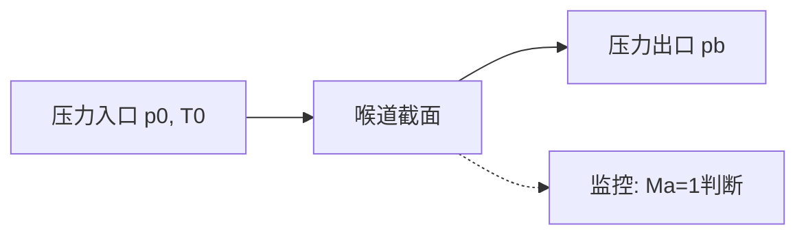

# 喉道临界流

核心研究

## 物理机制

喉道临界流（Critical Flow / Choked Flow）是指流体在渐缩-渐扩通道中，喉道截面处流速达到当地声速时的流动状态。此时下游压力波动无法向上游传播，质量流量达到最大值。

## 理论基础

### 临界条件

对于等熵流动，喉道临界条件为马赫数 Ma = 1：

$$
Ma = \frac{v}{a} = 1
$$

其中声速：

$$
a = \sqrt{\gamma R T}
$$

### 临界压力比

$$
\frac{p^*}{p_0} = \left(\frac{2}{\gamma + 1}\right)^{\frac{\gamma}{\gamma - 1}}
$$

式中：
- $p^*$ — 喉道临界压力
- $p_0$ — 上游总压
- $\gamma$ — 比热比（烟气约 1.33）

### 临界质量流量

$$
\dot{m}_{max} = \frac{A_t \ p_0}{\sqrt{T_0}} \sqrt{\frac{\gamma}{R}\left(\frac{2}{\gamma+1}\right)^{\frac{\gamma+1}{\gamma-1}}}
$$

## SCR系统中的意义

### 1. 流量精度

在SCR系统中，喉道临界流状态的建立可以确保：
- 质量流量仅取决于上游参数（$p_0$, $T_0$），与下游背压无关
- 流量可精确计算和控制
- 为尿素喷射量的计量提供准确的烟气流量基准

### 2. 参数影响分析

| 参数 | 变化趋势 | 对临界流量的影响 |
|------|---------|----------------|
| 上游总压 ↑ | - | 临界流量 ↑ (线性) |
| 上游总温 ↑ | - | 临界流量 ↓ ($\propto 1/\sqrt{T_0}$) |
| 喉道面积 ↑ | - | 临界流量 ↑ (线性) |
| 比热比 γ ↑ | - | 临界流量 ↑ (非线性) |

## CFD参数设置

### 模型选择

| 项目 | 推荐设置 | 备注 |
|------|---------|------|
| 求解器 | 密度基 (Density-Based) | 可压缩流动 |
| 通量格式 | AUSM / Roe-FDS | 激波捕捉能力 |
| 空间离散 | 二阶迎风 | 精度与稳定性平衡 |
| CFL数 | 1~5 | 初始阶段降低 |

### 边界条件

### 收敛判断

1. 喉道截面 Ma → 1.0
2. 质量流量不再随出口压力变化
3. 残差下降 3~4 个数量级

## 关键问题

### 实际气体效应

高温烟气中，理想气体假设的适用性需要验证。可采用真实气体状态方程（如 Redlich-Kwong）进行对比。

### 边界层影响

喉道边界层位移厚度会减小有效流通面积，导致实际临界流量低于理论值：

$$
\dot{m}_{actual} = C_d \cdot \dot{m}_{ideal}
$$

$C_d$（流量系数）通常为 0.95 ~ 0.99，取决于喉道几何和雷诺数。

## 下一步工作

- [ ] 确定SCR系统喉道几何参数
- [ ] 建立可压缩CFD模型
- [ ] 验证不同背压下的临界流量稳定性
- [ ] 标定流量系数 $C_d$
