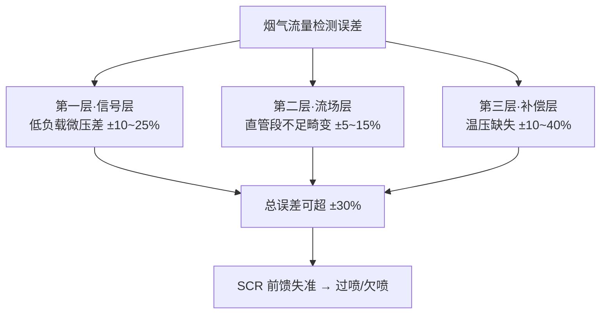

# SCR 烟气流量检测问题与解决路径探讨

<span class="tag tag-blue">系列第一篇</span> <span class="tag tag-orange">压差式检测</span> <span class="tag tag-blue">直管段优化</span> <span class="tag tag-green">温压补偿</span>

> 以压差式检测法为核心，对比文丘里、阿牛巴、孔板与锥形流量计，兼论直管段优化与温压补偿
>
> SCR 脱硝系统研究系列 · 第一篇 · 2026-07

本篇为系列第一篇，与后两篇构成完整闭环：

- 第一篇（本篇）——烟气流量检测：压差式检测对比文丘里/阿牛巴/孔板/锥形
- 第二篇《[SCR系统喷枪选择——从雾化机理到工程匹配](/files/SCR系统喷枪选择技术文章.pdf)》——气助式喷枪选型与混合管协同
- 第三篇《[SCR管路及催化剂封装计算设计](/files/SCR管路及催化剂封装计算设计.pdf)》——混合管与催化剂封装计算

[📄 下载本文 PDF 原文件](/files/SCR烟气流量检测问题与解决路径探讨.pdf)

## 1. 引言：流量检测——SCR 控制绕不过去的坎

在 SCR（选择性催化还原）脱硝系统中，烟气流量是计算尿素/氨喷射量的关键输入。SCR 控制的本质是一个**前馈 + 反馈**的闭环：前馈部分依据 `NOx 浓度 × 烟气流量 × 目标脱除率` 计算基础喷氨量，反馈部分通过出口 NOx 浓度修正。如果流量测不准，前馈计算就失去根基，反馈不仅要承担更大修正负担，还可能因响应滞后导致**过喷氨**（氨逃逸，腐蚀下游、形成硫酸氢铵堵空预器）或**欠喷氨**（脱硝不达标）。

然而烟气流量检测恰恰是 SCR 系统中最棘手的环节：发动机排气温度宽、湿度大、含颗粒、流速脉动，加上现场空间受限、直管段严重不足，常规工业流量计难以直接照搬。多数系统出于成本采用压差式检测，却在实际应用中暴露出"**测不准**"和"**算不准**"的双重问题。

## 2. SCR 烟气流量检测面临的特殊挑战

### 2.1 发动机排气特性的天然困难

- **流速范围宽且脉动剧烈**：工况从怠速到满载，流量变化可达 10:1 以上，且有明显排气脉动（尤其单/少缸机），压差信号呈低频波动，难以稳定读取。
- **温度变化大**：排气温度从低负载 ~200℃ 到高负载 500℃ 以上，烟气密度变化近一倍；不做温压补偿时，仅密度变化引入的流量误差就可超 40%。
- **含湿量大**：柴油 H₂O 体积分数约 8~12%，燃气机可达 15~20%，高湿还易在取压管路凝结、堵塞引压管。
- **含颗粒物**：碳烟（PM）逐渐附着节流元件表面，改变流通面积，导致流量系数漂移。

### 2.2 低负载工况下的微压差困境

这是压差式流量计在 SCR 中最核心的矛盾——压差与流量平方成正比：$Q = C \cdot A \cdot \sqrt{2\Delta P / \rho}$。当流量降至满量程 30% 时压差仅 9%，20% 时仅 4%。

> **典型算例**：某柴油发动机满载排气约 1200 m³/h，孔板满量程压差 2500 Pa。30% 负载时压差仅 225 Pa，20% 时 100 Pa，10% 怠速时低至 25 Pa。常规差压变送器精度为量程 ±0.1%~0.25%，在 25 Pa 点仅变送器误差就达 ±2.5~6.25 Pa（相对 ±10%~25%），叠加引压管与温漂后，低负载区流量测量几乎不可用。

### 2.3 直管段严重不足

SCR 通常装在发动机排气尾部至消声器之间，空间紧凑，弯头/变径/分支密布。各流量计直管段要求与现场实际：

| 流量计 | 要求上游直管段 | SCR 现场实际 |
|--------|---------------|-------------|
| 标准孔板 | 20D~40D | 往往 < 3D~5D |
| 文丘里管 | 5D~20D | 往往 < 3D~5D |
| 阿牛巴 | 15D~30D | 往往 < 3D~5D |

直管段不足 → 流速分布畸变 → 流量系数偏离标定值 → 误差不可预测。

### 2.4 温压补偿缺失——"算不准"的根源

相当数量的 SCR 厂家根本不做温压补偿，直接用工况压差计算流量。压差式测得的是**工况体积流量**，而控制需要质量/标况体积流量。温度从 200℃ 升至 500℃ 时烟气密度下降约 40%，若不修正，流量读数将偏低约 20%（因 $Q \propto 1/\sqrt{\rho}$），直接拉低喷氨计算。

### 2.5 安装位置不当——流量计装在尿素喷头后面

部分厂家为在低负载获得更大压差信号，把流量计装在尿素喷嘴下游。这是原理性错误：喷雾本身改变流场、尿素蒸发吸热致局部温度突变、结晶沉积改变流通特性；更关键的是控制逻辑上本末倒置——用"被改变后的流量"反推"原始流量"。

## 3. 压差式检测基本原理与系统性局限

### 3.1 基本原理

根据伯努利与连续性方程（低马赫数气体近似）：

$$Q_{工况} = C \cdot \varepsilon \cdot A \cdot \sqrt{\frac{2\Delta P}{\rho}}$$

$$Q_{标况} = Q_{工况} \times \frac{P_{工况}}{P_{标况}} \times \frac{T_{标况}}{T_{工况}}$$

其中 $C$ 流量系数（几何+雷诺数）、$\varepsilon$ 气体膨胀系数、$A$ 节流孔面积、$\Delta P$ 压差、$\rho$ 工况密度。

### 3.2 系统性局限的三个层次

SCR 中"不准"不是单因，而是三层问题叠加：

| 层次 | 问题本质 | 具体表现 | 典型误差贡献 |
|------|---------|---------|-------------|
| 第一层：信号层 | 低负载压差信号过弱 | 变送器分辨率不足、信噪比差 | ±10%~25%（低负载区） |
| 第二层：流场层 | 直管段不足导致流场畸变 | 流量系数偏离、非线性误差 | ±5%~15% |
| 第三层：补偿层 | 温压补偿缺失/不完善 | 密度计算错、工况/标况转换错 | ±10%~40%（宽温区） |

三层叠加，最恶劣工况总误差可超 **±30%**，远超 SCR 控制所需的 ±3%~5%。



## 4. 主要压差式检测手段对比分析

### 4.1~4.5 五种主流方案

| 方案 | 优点 | SCR 场景缺点 | 适用判断 |
|------|------|-------------|---------|
| 标准孔板 | 最简单、成本最低、ISO 5167 标准化 | 压损大(50~70%ΔP)、直管段要求最高(20D~40D)、量程比小(3:1)、易磨损积灰 | **不推荐** |
| 多孔孔板（整流孔板） | 兼具节流+整流，上游可缩至 2D~5D，压损降 50%+，精度 ±1~1.5% | 成本高 2~3 倍、低流速压差仍弱、需 CFD 验证 | 可用（直管段受限时佳） |
| 文丘里管 | 压损最小(10~25%ΔP)、精度 ±0.5~1%、量程比 6:1~10:1、耐磨损 | 体积大(3D~8D)、成本高、喉部易积灰 | 推荐（空间充裕/大管径） |
| 阿牛巴（均速管） | 压损极小、可在线安装、成本适中、多点取压 | 直管段要求高(15D~30D)、信号弱、取压孔易堵、抗脉动差 | 不推荐（SCR 多数场景） |
| V 型锥形（V-Cone） | 整流最强(上游 0D~3D)、精度 ±0.5%、量程比 10:1~15:1、抗脏污、信号增强 | 成本高 3~5 倍、锥体悬臂有脉动疲劳风险 | **最推荐** |

### 4.6 综合对比表

| 对比项 | 标准孔板 | 多孔孔板 | 文丘里管 | 阿牛巴 | V 型锥形 |
|--------|---------|---------|---------|--------|---------|
| 精度 | ±1%~2% | ±1%~1.5% | ±0.5%~1% | ±1%~2% | ±0.5% |
| 量程比 | 3:1~4:1 | 4:1~6:1 | 6:1~10:1 | 5:1~8:1 | 10:1~15:1 |
| 压损 | 大(50-70%ΔP) | 中(30-50%ΔP) | 小(10-25%ΔP) | 极小 | 中(20-40%ΔP) |
| 上游直管段 | 20D~40D | 2D~5D | 5D~10D | 15D~30D | 0D~3D |
| 抗脏污 | 差 | 较好 | 中 | 差(易堵) | 好 |
| 低流速性能 | 差 | 中 | 中 | 差 | 较好 |
| 成本 | 最低 | 中 | 高 | 中 | 较高 |
| SCR 适用性 | 不推荐 | 可用 | 推荐 | 不推荐 | 最推荐 |

## 5. 混合直管段优化与流场整流

### 5.1 直管段不足的影响机理

流量系数 $C$ 在充分发展管流下标定时；上游弯头/变径使流速分布偏离 1/7 次幂律，出现**不对称分布**、**二次流/旋涡**、**脉动增强**，导致系数非线性偏离。

### 5.2 整流器方案

| 整流器 | 整流效果 | 压损 | 上游直管段缩至 |
|--------|---------|------|---------------|
| 管束式（19 管束） | 好 | 小 | 约 10D |
| Zanker 板式 | 很好 | 中 | 约 5D~8D |
| 多孔板（Etoile/星形） | 好 | 小~中 | 约 5D~10D |
| Nova 超紧凑 | 极好 | 中 | 约 2D~3D |

> **工程建议**：SCR 紧凑管路推荐"**多孔板整流器 + V 型锥/多孔孔板**"组合，整流器装在流量计上游 2D~3D，即使在弯头后仅 3D~5D 条件下也能将流量系数偏差控制在 ±2% 以内。

### 5.3 混合器与流量检测一体化

静态混合器（促进尿素混合）本身扰动流场；可将其出口导流叶片设计为同时实现混合与整流，把流量计布置在混合器下游 3D~5D 处（湍流需距离衰减，太近则信号噪声大）。

### 5.4 CFD 仿真驱动的定制化设计

批量应用强烈建议用 CFD：建三维模型（含弯头/变径/混合器/流量计）→ 多工况点仿真 → 定最佳安装位 → 评估整流器 → 验证均匀度 → 定制流量系数标定表。

## 6. 温压补偿：被忽视的"第二重不准"

### 6.1 必要性

$Q_{标况} = Q_{工况} \times (P_{工况}/T_{工况}) \times (T_{标况}/P_{标况})$，温度对密度影响最显著：

| 工况 | 排气温度 | 烟气密度(相对) | 不做补偿的流量误差 |
|------|---------|---------------|-------------------|
| 低负载 | 220℃(493K) | 1.00(基准) | — |
| 中负载 | 350℃(623K) | 0.79 | 约 -12% |
| 高负载 | 480℃(753K) | 0.65 | 约 -24% |

不做补偿时温度升 260℃，流量读数偏低约 24%，喷氨量随之偏低约 24%，直接拖垮脱硝效率。

### 6.2 补偿实施方案

1. 温度：流量计下游 1D~2D 装 K 型热电偶或 PT100，精度 ±2℃ 内；
2. 压力：附近装绝压变送器，精度 ±0.5kPa 内；
3. 密度：依温度/压力/组分实时计算；
4. 修正：PLC/DCS 实时执行，输出标况流量。

> **关键结论**：温压补偿是投入产出比最高的优化——增加温/压传感器仅数百元，却可消除 10%~40% 的系统性误差。不做补偿的 SCR，流量精度讨论毫无意义。

### 6.3 烟气组分对密度的影响

| 组分 | 柴油排气(体积%) | 燃气排气(体积%) |
|------|----------------|----------------|
| N₂ | ~75 | ~73 |
| CO₂ | ~8 | ~10 |
| H₂O | ~9 | ~17 |
| O₂ | ~8 | ~0 |
| 平均分子量 | ~28.5 | ~27.2 |

两者密度差异约 5%；燃料固定可按固定组分算，可变则需依 O₂ 传感器动态修正。

## 7. 低负载工况的流量检测策略

低负载微压差是核心难题，可组合以下策略：

| 策略 | 做法 | 效果 |
|------|------|------|
| 双量程变送器 | 高/低量程并联(如 0~2500 / 0~250 Pa)平滑切换 | 量程比可达 30:1+ |
| 可变截面/可调孔径 | 锥体调位改变环形面积，恒压差输出 | 量程比 50:1+，机构复杂 |
| 软测量辅助 | 用转速/扭矩/进气量/排气温度经验或数据模型估算 | 低负载稳定，不依赖压差 |
| NOx 反馈修正 | 前馈为主、反馈为辅，前馈误差控 ±5% 内 | 响应滞后，不能完全替代 |

> **软测量模型参考**：排气流量 ≈ 进气量 × (1 + 燃空比) × (T排气/T进气)。低负载区以软测量为主，中高负载以压差为主，过渡区加权融合。

## 8. 安装位置与系统布局优化

**核心原则**：流量计必须装在尿素喷嘴**上游**——不可妥协。理由：流量未被喷雾干扰、温度场均匀、无结晶风险、控制因果链完整（流量→喷氨量→喷射）。

若上游安装致低负载压差不足，正确做法是选信号增强型节流件（V 型锥压差比孔板大 30%~50%）+ 低量程高精度变送器 + 双量程方案 + 软测量辅助——**而非把流量计移到喷嘴下游**。

排气管路布局建议：系统设计阶段预留 ≥5D 直管段；弯头用大半径(R≥1.5D)；变径锥角 ≤15°；上游避免阀门，不可避免则加整流器；引压管路取压口朝下/水平、连续向下倾斜、加冷凝容器或隔离膜片。

## 9. 结论与工程建议

### 9.1 问题总结

测不准（低负载微压差 + 直管段不足 + 堵塞磨损）、算不准（温压缺失 + 工况/标况转换错 + 密度简化）、装不对（装在喷嘴下游）。

### 9.2 选型建议

| 应用场景 | 推荐方案 | 理由 |
|---------|---------|------|
| 空间紧凑、直管段 <3D（移动源/车载） | V 型锥形 + 前置整流器 | 自带整流、直管段要求最低、量程比最大 |
| 空间中等、直管段 3~5D（中小功率固定源） | 多孔孔板 + 整流器 | 性价比好、整流明显 |
| 空间充裕、直管段 >5D（大功率机组） | 文丘里管 | 精度最高、压损最小、适合大管径 |
| 大管径、清洁排气（燃气机组） | 阿牛巴(需配整流器) | 大管径成本优势明显 |
| 任何场景 | **不推荐标准单孔板** | 直管段要求高、压损大、量程比小 |

### 9.3 综合优化建议清单

1. 流量计必须安装在尿素喷嘴上游——底线原则；
2. 必须实施温压补偿——成本极低、效果显著；
3. 选用直管段要求低的节流件——V 型锥/多孔孔板首选；
4. 直管段不足时加装整流器——投入小、效果明确；
5. 低负载区采用双量程变送器或软测量——解决微压差；
6. 引压管路做好防冷凝设计——取压口朝下、管路倾斜、定期吹扫；
7. 系统设计阶段用 CFD 仿真优化布局；
8. 定期维护校准——检查节流件磨损/积灰、校核流量系数。

### 9.4 展望

超声波流量计（无压损、大量程比、无可动件）、热式质量流量计（直测质量流量）、多传感器融合（压差+热式+NOx+发动机参数）、数字孪生是未来方向。但在新技术规模应用前，把现有压差式做对——**选对节流件、装对位置、做好补偿、整好流场**——才是当前最务实有效的路径。

> **选型决策速查**（基于直管段长度）
>
> ```mermaid
> flowchart TD
>     S[开始：评估可用直管段 L] --> A{L < 3D?}
>     A -- 是 --> V[V 型锥形 + 前置整流器]
>     A -- 否 --> B{3D ≤ L ≤ 5D?}
>     B -- 是 --> M[多孔孔板 + 整流器]
>     B -- 否 --> C{L > 5D?}
>     C -- 是(大管径) --> W[文丘里管]
>     C -- 是(清洁燃气) --> AN[阿牛巴 + 整流器]
>     V --> X[必须温压补偿]
>     M --> X
>     W --> X
>     AN --> X
> ```

---

**配套参考**：喷头设计与安装方式对比、长管路喷射量误差分析、催化剂分析报告等（见[网站文件下载页](/data/files)）。

[📄 下载本文 PDF 原文件](/files/SCR烟气流量检测问题与解决路径探讨.pdf)
