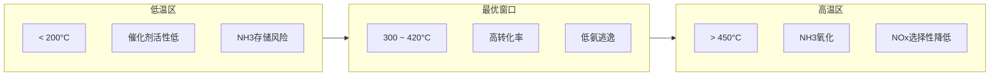

# 氨逃逸与NOx控制

<span class="tag tag-blue">核心研究</span> <span class="tag tag-green">排放控制</span>

## 正比关系分析

### 关键发现

在SCR系统分析中，**氨逃逸值（NH₃ Slip）与出口NOx测试值成正比关系**。

### 物理机制

```
高NH₃供给 → SCR反应更完全 → NOx出口浓度降低
                ↓ 
         过剩NH₃ → 氨逃逸增加

低NH₃供给 → 氨逃逸降低
                ↓
         NH₃不足 → NOx转化率降低 → NOx出口浓度升高
```

这形成了**氨逃逸与NOx排放的权衡（Trade-off）关系**：

$$
\text{NH}_3\ \text{slip} \propto \frac{1}{\text{NO}_x\ \text{conversion}} \ \text{（在NSR>1区域）}
$$

## SCR反应化学

### 主反应

标准SCR：

$$
4\text{NH}_3 + 4\text{NO} + \text{O}_2 \rightarrow 4\text{N}_2 + 6\text{H}_2\text{O}
$$

快速SCR（有NO₂参与）：

$$
2\text{NH}_3 + \text{NO} + \text{NO}_2 \rightarrow 2\text{N}_2 + 3\text{H}_2\text{O}
$$

NO₂-SCR（低速）：

$$
8\text{NH}_3 + 6\text{NO}_2 \rightarrow 7\text{N}_2 + 12\text{H}_2\text{O}
$$

### 副反应

氨氧化（高温下）：

$$
4\text{NH}_3 + 3\text{O}_2 \rightarrow 2\text{N}_2 + 6\text{H}_2\text{O}
$$

$$
4\text{NH}_3 + 5\text{O}_2 \rightarrow 4\text{NO} + 6\text{H}_2\text{O} \ \text{（不希望的）}
$$

## 关键定义

### 氨氮摩尔比 (NSR)

$$
\text{NSR} = \frac{\dot{n}_{NH_3}}{\dot{n}_{NO_x}} = \frac{\dot{m}_{NH_3}/M_{NH_3}}{\dot{m}_{NO_x}/M_{NO_x}}
$$

### NOx 转化率

$$
\eta_{NO_x} = \frac{C_{NO_x,in} - C_{NO_x,out}}{C_{NO_x,in}} \times 100\%
$$

### 氨逃逸

出口烟气中未反应的 NH₃ 浓度，通常要求 **≤ 3 ppm**（部分地区要求 ≤ 2 ppm）。

## 操作窗口分析



## CFD 模型策略

### 组分输运

需追踪的关键组分：
- **NO, NO₂** — NOx排放指标
- **NH₃** — 氨逃逸指标
- **N₂, O₂, H₂O, CO₂** — 载体组分
- **HNCO** — 尿素热解中间产物（可选）

### 反应速率

标准SCR反应速率（Eley-Rideal机制）：

$$
r_{SCR} = k_{SCR} \cdot \frac{K_{NH_3} C_{NH_3}}{1 + K_{NH_3} C_{NH_3}} \cdot C_{NO}
$$

氨氧化反应速率：

$$
r_{ox} = k_{ox} \cdot C_{NH_3}
$$

### UDF 实现要点

```c
/* 催化剂区域反应源项 */
DEFINE_SOURCE(scr_source, c, t, dS, eqn)
{
    real C_NO  = C_YI(c, t, idx_NO)  * C_R(c, t) / M_NO;
    real C_NH3 = C_YI(c, t, idx_NH3) * C_R(c, t) / M_NH3;
    real C_O2  = C_YI(c, t, idx_O2)  * C_R(c, t) / M_O2;
    real T     = C_T(c, t);

    real k_scr = A_scr * exp(-Ea_scr / (R * T));
    real r_scr = k_scr * (K_NH3 * C_NH3) / (1 + K_NH3 * C_NH3) * C_NO;

    /* NO消耗 */
    if (eqn == idx_NO) {
        dS[eqn] = -k_scr * (K_NH3 * C_NH3) / (1 + K_NH3 * C_NH3) * C_R(c,t)/M_NO;
        return -4.0 * r_scr * M_NO;
    }
    /* NH3消耗 */
    if (eqn == idx_NH3) {
        dS[eqn] = -k_scr * C_NO * K_NH3/pow(1+K_NH3*C_NH3,2) * C_R(c,t)/M_NH3;
        return -4.0 * r_scr * M_NH3;
    }
    return 0.0;
}
```

## 控制策略

### 1. NSR 优化

| NSR | NOx转化率 | NH₃逃逸 | 综合评价 |
|-----|----------|---------|---------|
| 0.8 | ~80% | < 1 ppm | 排放不达标 |
| 0.9 | ~90% | < 2 ppm | 边界 |
| **1.0** | **~95%** | **2~5 ppm** | **推荐** |
| 1.1 | ~97% | 5~15 ppm | 氨逃逸超标 |
| 1.2 | ~98% | > 15 ppm | 不可接受 |

### 2. 温度窗口控制

确保催化剂入口温度在 **300 ~ 420°C** 范围内：
- 过低: 催化剂活性不足，NH₃存储
- 过高: NH₃氧化加剧，生成额外NOx

### 3. 均匀性优化

- NH₃/NOx 摩尔比截面偏差 ≤ ±5%
- 速度均匀性 UI ≥ 0.90
- 温度均匀性 σT ≤ 10 K

## 总结

氨逃逸与NOx排放的正比关系是SCR系统设计的核心约束。优化的关键在于：
1. 精确控制 NSR ≈ 1.0
2. 保证 NH₃ 在催化剂截面的均匀分布
3. 控制催化剂在最佳温度窗口运行
