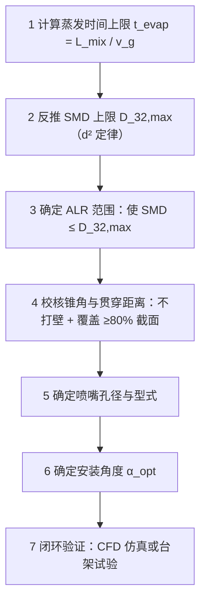

# SCR 系统喷枪选择——从雾化机理到工程匹配

系列第二篇 气助式喷枪 雾化粒径 混合管协同

> 气助式喷枪参数体系、安装方式与混合管设计协同分析
>
> SCR 脱硝系统研究系列 · 第二篇 · 2026-07

本篇为系列第二篇，与前后两篇构成完整闭环：

- 第一篇《[SCR控制系统烟气流量检测存在的问题与解决路径探讨](/files/SCR烟气流量检测问题与解决路径探讨.pdf)》——压差式检测对比文丘里/阿牛巴/孔板/锥形
- 第二篇（本篇）——喷枪选择：气助式喷枪选型与混合管协同
- 第三篇《[SCR管路及催化剂封装计算设计](/files/SCR管路及催化剂封装计算设计.pdf)》——混合管与催化剂封装计算

[📄 下载本文 PDF 原文件](/files/SCR系统喷枪选择技术文章.pdf)

## 1. 问题全景：喷枪选择不是"买个喷头"那么简单

尿素喷射是连接计量与催化的唯一桥梁，喷枪性能决定尿素能否在有限空间/时间内完成**雾化→蒸发→热解→与 NOx 混合**。实际工程中喷枪常处于"被动适配"：只看喷射量达标、安装看哪里方便钻孔，至于雾化粒径是否匹配催化剂反应速率、喷射角度是否匹配管径与直管段、喷射距离是否会打壁，往往调试阶段才暴露。

对"隔膜计量泵 + 气助式喷枪"系统更复杂：雾化质量同时依赖液相（流量、液压）和气相（气压、气量）协同，任何偏差都传导到粒径与形态；叠加管路压损、喷嘴/泵端计量偏差、混合管空间约束，**喷枪选择是多参数耦合的系统工程**。

> **核心论点**：喷枪选择不是孤立选型，而是"雾化粒径 ↔ 催化剂反应动力学""喷射角度 ↔ 混合管几何""液/气压力 ↔ 管路压损与计量精度"三组耦合关系的求解。正确流程：**先定目标粒径 → 反推雾化条件 → 选喷嘴型式 → 校核安装几何 → 闭环验证**。

## 2. 雾化机理：从 Weber 数到 Sauter 平均粒径

### 2.1 液力与气力雾化的双驱动

- **液力雾化**（液压驱动）：$v \propto \sqrt{\Delta P}$，压力升 4 倍速度仅升 2 倍。
- **气力雾化**（气流剪切）：压缩空气在喷嘴出口高速碰撞液膜/液柱，气动剪切撕裂液滴。气助式核心优势：雾化对压力依赖远低于液力，低液压下仍可得细雾。

**Weber 数**（雾化细度判据）：

$$We = \frac{\rho_g \cdot v_{rel}^2 \cdot d}{\sigma}$$

$\rho_g$ 气体密度、$v_{rel}$ 气-液相对速度、$d$ 液滴/液柱直径、$\sigma$ 尿素溶液表面张力（~65 mN/m）。

关键推论：**We > 12** 进入二次雾化区，**We > 40** 进入细雾化区。气助式通过提升 $v_{rel}$ 提高 We，这是其优于纯液力雾化的根本。

### 2.2 Sauter 平均粒径（SMD / $D_{32}$）——雾化质量黄金指标

$D_{32}$ 定义为总液滴体积/总液滴表面积（与实际液滴群同体积/面积比的等效球径）。用它是因为 SCR 反应速率取决于液滴表面积（蒸发速率 ∝ 表面积），而喷射量取决于体积，$D_{32}$ 正好是二者之比。

**气助式 SMD 经验公式（Kim-Marshall 修正）**：

$$D_{32} = C \cdot \frac{(\rho_l \cdot \sigma \cdot d_{nozzle})^{0.5}}{(\rho_g \cdot v_{rel})^{0.5}} \cdot (ALR)^{-\alpha}$$

$C$ 喷嘴结构常数、$\rho_l$ 尿素溶液密度(~1090 kg/m³)、$\sigma$ 表面张力、$d_{nozzle}$ 喷嘴孔径、$ALR$ 气液比、$\alpha$ 幂指数(0.5~0.8)。

核心关系：① $ALR$ 越大 → $D_{32}$ 越小；② 气液相对速度越高 → $D_{32}$ 越小；③ 喷嘴孔径越大 → $D_{32}$ 越大。

**目标粒径依据**（蒸发时间与混合管长度关系）：

| $D_{32}$ | 蒸发时间 | 适用混合管 |
|---------|---------|-----------|
| ≤ 50 μm | < 0.1 s | 短混合管(<1m)或低温 |
| ≤ 100 μm | ~0.3 s | 中等(1~3m) |
| ≤ 200 μm | ~1 s | 长(>3m)，有结晶风险 |
| > 200 μm | — | 不适合 SCR |

我们的目标：结合混合管设计，将 $D_{32}$ 控制在 **50~80 μm**。

## 3. 喷枪参数体系：七参数耦合与优先级

| 参数 | 性质 | 控制归属 | 对 SMD 影响 | 优先级 |
|------|------|---------|------------|--------|
| 破碎粒径 $D_{32}$ | 目标参数 | 选型+调试 | 间接影响蒸发与混合 | ★★★★★ |
| 气液比 ALR | 核心驱动 | 气管压力+气量 | $ALR\uparrow \to D_{32}\downarrow$ 显著 | ★★★★★ |
| 液管压力 $\Delta P_l$ | 驱动参数 | 计量泵+管路压损 | $\Delta P_l\uparrow \to D_{32}\downarrow$(弱) | ★★★★ |
| 气管压力 $\Delta P_g$ | 驱动参数 | 空压机+减压阀 | $\Delta P_g\uparrow \to D_{32}\downarrow$(强) | ★★★★ |
| 喷射量 | 约束参数 | 泵行程+喷嘴孔径 | 喷射量↑→$ALR\downarrow$→$D_{32}\uparrow$ | ★★★ |
| 喷射角度 | 形态参数 | 喷嘴结构+气液交互 | 间接影响覆盖与打壁 | ★★★ |
| 喷射距离 | 形态参数 | 气液动量比 | 间接影响打壁与覆盖深度 | ★★★ |

**优先级结论**：第一 ALR（最强控制变量，每提升 0.1 可降 SMD 15%~25%）；第二 液/气管压力（ALR 底层驱动）；第三 喷射角度与距离（安装几何适配）。

## 4. 喷嘴孔径计算：喷射量与雾化粒径的矛盾

孔径决定最大喷射量基线：孔径↑→流量上限↑→液柱越粗→需更多气动剪切能量。大功率需大孔径却不利细化；气助式靠足够 ALR 仍可压到目标，但过高 ALR 增耗气且锥角过度展开。

$$d_{nozzle} = \sqrt{\frac{4Q_{target}}{\pi \cdot C \cdot \sqrt{2\Delta P_l / \rho_l}}}$$

实践：先按最大工况算 $d_{nozzle}$，再校核最低工况 $ALR \ge 0.5$，不足则考虑多孔方案。

**单孔 vs 多孔**：多孔雾化粒径显著减小、可做扇形/环形覆盖，但相邻喷雾锥干涉会使局部粒径变大——孔间距应 ≥ 2 × 喷射距离 × tan(半锥角)。

## 5. 安装方式：轴向、垂直、夹角——形态与混合的博弈

| 安装方式 | 停留时间 | 混合效率 | 打壁风险 | 适用场景 |
|---------|---------|---------|---------|---------|
| 轴向（顺流） | 最长 | 低 | 最低 | 长直管段、大管径、高温 |
| 垂直（横穿） | 中等 | 高 | 最高 | 短混合管、需快速混合 |
| 夹角（斜穿） | 较长 | 较高 | 中等 | **最优折中** |

### 5.1 垂直安装的打壁风险

不打壁条件：$L_{pen} \le D_{pipe} - 2\delta$。动量比 $MR = (\rho_l v_l^2)/(\rho_g v_g^2)$，$MR$ 越大贯穿越远。

> **打壁危害链**：尿素打壁 → 管壁湿面 → 热解不完全 → 缩合物/聚合物 → 结晶堆积 → 管壁腐蚀 + 流场畸变 + 喷射量计量失准。

### 5.2 夹角安装的优化空间

夹角更适合本项目：雾滴有轴向分速（停留更长）+ 径向分速（交叉剪切）+ 径向贯穿可控。

$$\alpha_{opt} = \arcsin\!\left(\frac{D_{pipe} - 2\delta}{L_{pen}}\right)$$

## 6. 喷射角度与喷射距离：形态参数的工程约束

### 6.1 喷射角度（雾化锥角）

低 ALR 时锥角 30°~50°（液柱集中、穿透远）；高 ALR 时 60°~90°（雾滴分散、穿透短）。

**锥角-管径匹配法则**：

$$D_{cone}(L) = 2L \cdot \tan(\theta/2) \le 0.8 \cdot D_{pipe}, \quad \theta_{max} = 2\cdot\arctan(0.4 \cdot D_{pipe}/L)$$

角度与距离必须联合校核——距离越长，允许锥角越小。

### 6.2 喷射距离（贯穿距离）

$$L_{pen}/D_{pipe} \approx k \cdot MR^{0.5}$$

喷射量↑→$MR$↑→贯穿↑→打壁↑；气量↑→$MR$↓→贯穿↓→打壁↓，但 $ALR$↑→锥角↑。需数值校核平衡。

## 7. 液管压力与气管压力：驱动参数与管路耦合

### 7.1 液管压力

喷嘴端有效压力 $\Delta P_l = P_{pump} - \Delta P_{loss} - P_{back}$。管路越长→压损越大→喷嘴端压力越低→雾化质量下降 + 计量偏差加剧。**缩短管路是同时解决雾化与计量的根本措施**。

### 7.2 气管压力

作用：雾化驱动、喷射形态控制、管路清吹、防结晶。典型设定：

| 负载 | 气管压力 | ALR | SMD |
|------|---------|-----|-----|
| 低负载 | 0.2~0.3 MPa | 0.8~1.5 | 30~50 μm |
| 中负载 | 0.3~0.4 MPa | 0.3~0.8 | 50~80 μm |
| 高负载 | 0.4~0.6 MPa | 0.15~0.3 | 80~120 μm |

> **低负载 ALR 过高问题**：ALR 自动升高→雾化极细但锥角过度展开→覆盖截面不足。对策：①适当降低气压；②脉冲喷射；③软测量动态调节。

## 8. 混合管设计协同：喷枪与管路的闭环匹配

从混合管反推喷枪参数：

**混合管-喷枪协同核心矛盾**：直管段短 → 要求 SMD 小 → 要求 ALR 高 → 锥角大 → 打壁风险高 → 需管径大 → 流速低 → 停留长 → SMD 要求又放宽。**不要追求极端 SMD，取合理中间值 50~80 μm，给锥角和贯穿留出裕量。**

## 9. 喷枪选型实战

1. 确定 SMD 目标 = **60~80 μm**；
2. 确定 ALR 范围 **0.3~1.0**；
3. 确定喷嘴孔径（最大工况计算，低负载校核 ALR）；
4. 校核锥角与贯穿距离是否满足不打壁；
5. 确定安装角度（$L_{pen} \le D_{pipe}/2-\delta$ 可垂直，否则夹角）；
6. 气管压力动态调节策略（比例减压阀 + PLC 闭环）；
7. 管路优化（缩短 ≤3m、内径 4~5mm、气路清吹、保温）。

## 10. 喷枪型式综合对比与推荐

| 喷枪型式 | SMD 范围 | 锥角范围 | ALR 需求 | 贯穿距离 | 防打壁 | 管路兼容 | 评分 |
|---------|---------|---------|---------|---------|--------|---------|------|
| 预膜式气助 | 30~60 μm | 60°~90° | 0.5~1.5 | 短~中 | 优 | 优 | ★★★★★ |
| 同轴式气助 | 50~100 μm | 30°~60° | 0.3~0.8 | 中~远 | 中 | 良 | ★★★★ |
| 多孔气助 | 40~80 μm | 定制 | 0.3~1.0 | 短~中 | 优 | 中 | ★★★★ |
| 纯液力 | 100~300 μm | 固定 | 无 | 远 | 差 | 简单 | ★★ |

**推荐方案**：首选**预膜式气助喷枪 + 夹角安装**（SMD 最小、锥角可控、贯穿适中、打壁风险低）；备选**多孔气助 + 垂直/小夹角**（大功率 ALR 不足的替代）；不推荐纯液力（粒径过大、不可调、低负载矛盾无法解）。

## 11. 调试与验证方法

| 参数 | 监测手段 | 调节手段 | 时机 |
|------|---------|---------|------|
| $D_{32}$ | 激光粒径仪/马尔文分析仪 | 间接：ALR、气压 | 选型+首次调试 |
| 喷射量 | 泵端流量计+收集法校准 | 泵行程/频率 | 实时 |
| 喷射角度 | 高速相机/激光片光 | 气压间接 | 首次调试 |
| 贯穿距离 | 可视化+热线风速仪 | MR 调节 | 首次调试 |
| 液管压力 | 喷嘴端压力传感器 | 泵出口+管路优化 | 实时监测 |
| 气管压力 | 减压阀出口压力表 | 比例减压阀 | 实时闭环 |
| 气流量 | 涡街/热式流量计 | 减压阀+管路节流 | 实时监测 |
| 氨逃逸 | 氨分析仪 | 喷射量+雾化联合 | 实时闭环 |

## 12. 总结

1. **目标优先**：从混合管约束反推 SMD → 反推 ALR → 确定喷嘴和气压策略；
2. **ALR 是核心杠杆**：同时控制 SMD、锥角和贯穿距离，调试优先锁定；
3. **安装角度是关键**：垂直打壁风险高，夹角安装是最优折中；
4. **管路是隐藏敌人**：长管路同时损害雾化与计量，缩短管路是系统级方案；
5. **动态调节不可省**：气管压力应随负载动态调节；
6. **预膜式气助 + 夹角安装**是当前项目最优方案。

---

**配套参考**：喷头设计与安装方式对比、长管路喷射量误差分析、催化剂分析报告等（见[网站文件下载页](/data/files)）。

[📄 下载本文 PDF 原文件](/files/SCR系统喷枪选择技术文章.pdf)
