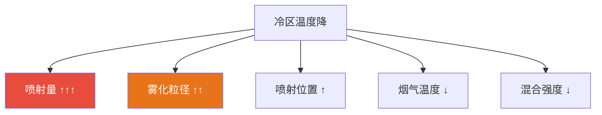

# 尿素喷射与冷区分析

核心研究 温度管理

## 问题描述

尿素水溶液（32.5% wt）喷射进入高温烟气后，其蒸发和热解过程均为**强吸热反应**，导致喷射区域下游催化剂层出现局部温度下降（冷区），影响催化剂活性和脱硝效率。

## 热力学分析

### 能量消耗分解

32.5%尿素溶液喷射的单位质量能量消耗：

| 过程 | 反应/相变 | 吸热量 (kJ/kg溶液) | 占比 |
|------|----------|-------------------|------|
| ① 溶液升温 | 298K → 373K | ~240 | 12% |
| ② 水分蒸发 | H₂O(l) → H₂O(g) | ~1525 | 76% |
| ③ 尿素升温 | 373K → 热解温度 | ~70 | 3% |
| ④ 尿素热解 | CO(NH₂)₂ → NH₃ + HNCO | ~170 | 9% |
| **合计** | | **~2005** | **100%** |

> ⚠️ **关键发现**: 水分蒸发潜热占能量消耗的 **76%**，是冷区温度下降的最主要贡献者。

### 温度降估算

绝热条件下（无壁面传热补偿），喷射区域的温降：

$$
\Delta T_{ad} = \frac{\dot{m}_{urea-sol} \cdot \Delta H_{total}}{\dot{m}_{gas} \cdot c_{p,gas}}
$$

**典型算例**：
- 烟气流量: 10 kg/s
- 尿素溶液喷射量: 0.05 kg/s (NSR=1.0)
- 烟气比热: 1.15 kJ/(kg·K)

$$
\Delta T_{ad} = \frac{0.05 \times 2005}{10 \times 1.15} \approx 8.7 \text{ K}
$$

## CFD模拟方法

### 模型设置

| 项目 | 设置 |
|------|------|
| 能量方程 | **必须开启** |
| 辐射模型 | DO / P1（高温下辐射不可忽略） |
| 组分输运 | 至少包含 H₂O(g)、NH₃、HNCO、烟气组分 |
| 离散相 | DPM + 蒸发 + 多组分液滴 |

### UDF/源项定义

#### 液滴蒸发质量源项

$$
S_m = -\sum_{parcels} \frac{d m_p}{d t} / V_{cell}
$$

#### 蒸发吸热能量源项

$$
S_h = -\sum_{parcels} \left( \frac{d m_{p,water}}{d t} \cdot L_v \right) / V_{cell}
$$

#### 热解吸热能量源项

$$
S_{h,pyro} = -\dot{r}_{urea} \cdot \Delta H_{pyro}
$$

## 冷区特征分析

### 影响因素排序

### 参数敏感度

| 参数 | 变化 | ΔT 响应 | 敏感度 |
|------|------|---------|--------|
| 喷射量 | +10% | +0.9K | **高** |
| SMD | +20% | +0.5K | **中** |
| 烟气温度 | -20K | +1.2K | **高** |
| 喷射距离 | +0.5m | -0.3K | 低 |

## 优化策略

### 1. 喷射位置优化

- **原则**: 喷射点到催化剂入口的距离 ≥ 液滴完全蒸发所需长度
- 采用 CFD 参数化扫描确定最优位置

### 2. 雾化优化

- 减小 SMD：提高喷射压力或优化喷嘴设计
- 增大喷雾锥角：扩大覆盖范围，减小局部浓度

### 3. 混合增强

- 在混合段设置静态混合器
- 优化管道布置增加湍流度

### 4. 分段喷射

- 多点喷射降低单点热负荷
- 各点喷射量按烟气流量比例分配

## 监控指标

| 指标 | 目标值 | 说明 |
|------|--------|------|
| 催化剂入口最大温降 | ≤ 15 K | 局部最低温/平均温度 |
| 温度分布标准差 | ≤ 10 K | 温度均匀性 |
| 液滴蒸发完成率 | ≥ 98% | 催化剂入口无液态 |
| NH₃分布 RMS | ≤ 10% | 氨浓度均匀性 |

---

## 补充：混合气体对催化剂温度的影响

### 冷区形成叠加效应

冷区形成有两个叠加效应：

**① 尿素水解吸热反应**

$$
CO(NH_2)_2 + H_2O \rightarrow 2NH_3 + CO_2 \quad \Delta H = +150\ \text{kJ/mol}
$$

尿素从液态裂解为氨气需要吸收大量热量，雾化液滴在裂解过程中持续从烟气吸热，导致局部温度下降。

**② 冷尿素液滴的物理显热吸收**

| 热消耗项 | 估算值 | 备注 |
|---------|--------|------|
| 液体升温 (20°C→103°C) | ~9.0 kW | 显热 |
| 水分蒸发 | ~39.6 kW | **潜热（主因）** |
| 尿素热解吸热 | ~4~8 kW | 化学反应热 |
| **合计** | **~52 kW** | |

烟气总热容（~320°C, 5 Nm³/min）≈ 5.4 kW/K

::: warning 关键数据
**冷区局部温降**: $\Delta T \approx 52\ \text{kW} / 5.4\ \text{kW/K} \approx 9\sim10°C$（稀释流场平均值）

但喷射锥核心区域的**局部瞬时温降可达 70~100°C**，将催化剂局部温度从 320°C 拉低至 150~250°C —— 恰好落入 180~250°C 的硫酸铵盐最易生成温度区间，这是**最危险的区域**。
:::

### 温度传感器布置优化

传统设计中在催化剂前后各设一个温度传感器。新系统中只有一个温度传感器，需要优化位置：

::: tip 关键结论
如果设定 250°C 启喷，极有可能造成过喷。因为一旦启喷后，温度会被拉低 30~50°C，使催化剂工作在低效率区，造成过喷。

**最佳方式**：在催化剂中间位置安装温度传感器，可精确建立催化剂温度模型，使催化剂始终工作在最佳温度区域。
:::

### 优化策略补充

除了前述喷射位置优化外：

1. **控制喷射位置**：喷射点距催化剂上游 300~500 mm，喷嘴轴线与烟气流向夹角 ≤ 15°，避免液滴直接撞击催化剂面
2. **预热尿素溶液**：罐温维持 30~50°C（电加热带），减少显热吸收，降低粘度改善雾化
3. **催化剂前保护**：入口 100 mm 处布置热电偶 T₁。当 T₁ < 250°C 时自动减少喷射量，防止冷区恶化
