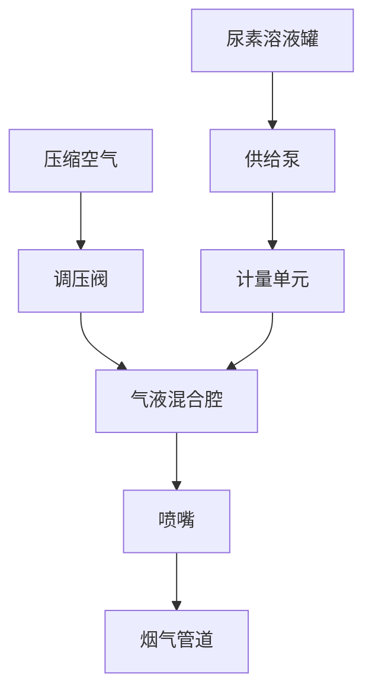

# 气助式尿素喷射系统

<span class="tag tag-orange">系统分析</span>

## 系统原理

气助式（Air-Assisted）尿素喷射系统利用压缩空气辅助尿素溶液的雾化和输送。相比纯液压喷射，气助式在低喷射量下仍能保持良好的雾化效果。



## 工作原理

### 气液两相混合

在喷嘴内部，压缩空气与尿素溶液在混合腔中形成气液两相流，通过喷嘴出口时：
1. 气相迅速膨胀
2. 液相被剪切破碎
3. 形成细小液滴

### 雾化机制

```
一次雾化: 液膜形成 → 气动力剪切 → 液丝断裂 → 液滴
二次雾化: 大液滴在气流中进一步破碎 (Weber > 临界值)
```

## 关键参数

### 操作参数

| 参数 | 典型范围 | 单位 |
|------|---------|------|
| 尿素溶液压力 | 3 ~ 8 | bar |
| 压缩空气压力 | 3 ~ 5 | bar |
| 气液质量比 (ALR) | 0.1 ~ 0.5 | kg/kg |
| 尿素流量范围 | 0.5 ~ 100 | kg/h |
| 调节比 (Turndown) | 10:1 ~ 50:1 | - |

### 雾化特性（气助式）

| 参数 | 典型值 | 说明 |
|------|--------|------|
| SMD | 20 ~ 60 μm | 优于纯液压 |
| 喷雾锥角 | 15° ~ 40° | 取决于喷嘴设计 |
| 液滴速度 | 15 ~ 40 m/s | 气液混合出口速度 |

## 长管路误差分析

### 核心问题

气助式系统的喷射量计量依据是泵端的流量计或阀门开启时间，但实际喷出量取决于**喷嘴端**的流量。泵和喷嘴之间的管路充满液体，这就是误差的根源。管路越长，误差越大。

| 管路内径 | 管路长度 | 残留体积 |
|:-------:|:------:|:------:|
| 6 mm | 1 m | ~28 mL |
| 6 mm | 2 m | ~57 mL |
| 6 mm | 3 m | ~85 mL |

> ⚠️ 管路 10 米时，残留体积接近 **200 mL**，误差相当可观。

### 三种误差类型

#### ① 喷射启动延迟（欠喷）

指令发出后，压缩空气先要把管路中已有液体"推送"到喷嘴才能喷出。

- 泵端已供了足够量，但喷嘴还没喷完
- 实际入催化剂的量 **小于** 目标量
- 导致 NOx 转化效率阶段性偏低

#### ② 停止后拖尾过喷

指令停止时，管路中仍残留一段液柱。气路关断但液体靠惯性、重力继续缓慢流出。

- 实际喷出量 **大于** 目标量
- 导致氨逃逸浓度偏高

#### ③ 多次喷射的累积误差

每次喷射结束时管路中的残留量 ΔV 不同（受气压、温度、液体粘度影响），残留量叠加到下次喷射的初始状态。每个周期的误差量都不相同，**简单的固定补偿系数难以有效修正**。

### 管路压降定量计算

Darcy-Weisbach 压降：

$$
\Delta p = f \frac{L}{D} \frac{\rho v^2}{2}
$$

| 管路长度 | 压降 | 喷射量误差 |
|:------:|:---:|:-------:|
| 10 m | ~0.3 bar | ~3% |
| 30 m | ~0.9 bar | ~8% |
| 50 m | ~1.5 bar | ~12% |

### 解决方案

| 方案 | 做法 | 效果 |
|------|------|------|
| **结构缩短管路** | 泵尽量靠近喷嘴，采用"泵阀一体化"集成设计 | **最根本** |
| **气路辅助清管** | 每次喷射后保持气路开 1~2s，吹出残余液体 | 需纳入计量模型 |
| **充液状态估计** | 跟踪每次喷射后残留量 ΔV，下次指令 = 目标 - 预估 | 依赖稳定气压 |
| **喷嘴端直接闭环** | 喷嘴附近加装超声波/科里奥利流量计 | 成本高但最精确 |
| **压力补偿** | 根据管长提高供给泵出口压力 | 简单但精度有限 |

## 与CFD的耦合

### 喷射边界条件

在CFD模拟中，气助式喷射的边界条件设置：

| CFD参数 | 设置方法 |
|---------|---------|
| 喷射类型 | Air-blast / Effervescent atomizer |
| 液滴粒径分布 | Rosin-Rammler: SMD + 分布指数 n |
| 喷射速度 | 根据气液混合出口速度 |
| 喷雾锥角 | 喷嘴设计值/实测值 |

### 简化处理

对于初步模拟，可以：
1. 采用锥形喷射源（Cone Injection）
2. 固定 SMD + RR分布
3. 喷射速度根据流量和喷孔面积估算

## 常见问题与解决

| 问题 | 原因 | 解决措施 |
|------|------|---------|
| 喷射量偏差大 | 管路压降/堵塞 | 定期清洗、压力补偿、缩短管路 |
| 雾化不良 | 气压不足/喷嘴磨损 | 检查空压机、更换喷嘴 |
| 尿素结晶 | 温度过高/停机残留 | 停机吹扫、温度控制 |
| 喷嘴堵塞 | 杂质/结晶 | 过滤、纯水清洗 |
| 长管路误差 | 残留液柱 | 气路清管、泵阀一体设计 |
