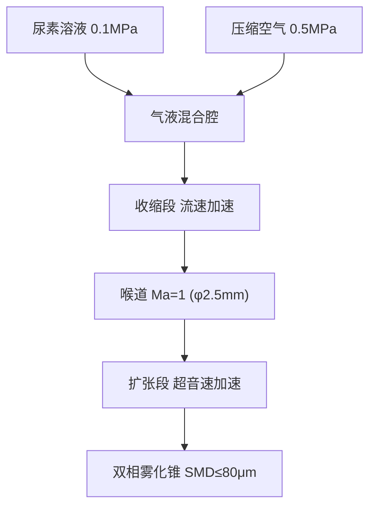
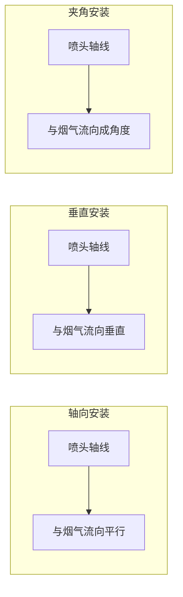

# 尿素喷嘴设计与安装

硬件设计 拉瓦尔雾化

## 喷嘴设计核心参数

喷嘴设计的主要参数只有两个：**压力**和**喷嘴孔径**。

### 1. 液压雾化细度 — Weber 数

雾化细度由 Weber 数决定，本质上是压力驱动：

$$
We = \frac{\rho \cdot v^2 \cdot d}{\sigma}
$$

其中：
- $\rho$ — 液体密度（尿素溶液 ~1.09 g/cm³）
- $v$ — 喷射速度（与 $\sqrt{\Delta P}$ 成正比）
- $d$ — 喷孔直径
- $\sigma$ — 表面张力（尿素溶液 ~65 mN/m）

**关键关系**：喷射速度 $\propto \sqrt{\Delta P}$，压力升高 4 倍，速度提升 2 倍，We 数提升约 2 倍。

### 2. 喷嘴孔径计算

喷嘴孔径根据**喷射量**反向计算。流量公式：

$$
Q = C_d \cdot A \cdot \sqrt{\frac{2\Delta P}{\rho}}
$$

式中：
- $Q$ — 体积流量
- $C_d$ — 流量系数（~0.6~0.9）
- $A$ — 喷孔截面积
- $\Delta P$ — 喷射压差

---

## 拉瓦尔雾化喷头

### 设计参数

采用**气液两相拉瓦尔（Laval）雾化喷头**，用于 3MW 柴油发电机 SCR 系统：

| 参数 | 值 | 单位 |
|------|-----|------|
| 尿素流量 | 95 | L/h |
| 气体压力 | 0.5 | MPa |
| 气液质量比 ALR | ≈ 0.35 | - |
| 液孔直径 | φ 3.0 | mm |
| 喉道直径 | φ 2.5 | mm |
| 出口直径 | φ 4.5 | mm |
| 扩张半角 | 7° | - |
| 喷头总长 | ≈ 340 | mm |
| 目标 SMD | ≤ 80 | μm |
| 材料 | 316L 不锈钢 | - |

### 截面结构图

### 工作原理

**核心原理**：
1. 尿素溶液从中心通道（φ3mm）进入
2. 压缩空气从环形通道进入混合腔
3. 两相流经收缩段加速至音速
4. 喉道处 Ma=1，形成临界流
5. 扩张段继续加速至超音速，气动力剪切完成雾化

---

## 喷头安装方式分析

### 三种安装方式

在 SCR 系统中，尿素雾化喷头的安装一般分三种方式：

### 对比分析

| 方式 | 优点 | 缺点 | 适用 |
|------|------|------|------|
| 轴向 | 混合路径最长，气化充分 | 占用轴向空间大 | 空间充裕 |
| 垂直 | 安装简单 | 贯穿距离短，易打壁 | 大口径管道 |
| **夹角** | **兼顾混合与空间** | 需要精确设计角度 | **推荐** |

### 关键设计约束

> ⚠️ **夹角的两个关键参数**：
> 1. **雾化夹角** — 由喷嘴设计决定
> 2. **喷射距离** — 喷嘴到对面管壁的距离

如果设计计算不合适：
- **打壁**：尿素喷到管壁 → 喷射量失准
- **混合不充分**：氨分布不均匀 → 脱硝效率偏差

### 喷射位置建议

1. 喷射点距催化剂入口：**300~500 mm**
2. 喷嘴轴线与烟气流向夹角：**≤ 15°**
3. 喷射点上游 **50~100 mm** 处设置静态混合器

---

## 喷头设计总结

| 设计要素 | 推荐方案 |
|---------|---------|
| 雾化方式 | 气助式拉瓦尔喷头 |
| 安装方式 | 夹角式（与烟气流向 10~15°） |
| 喷射距离 | ≥ 300 mm（到催化剂入口） |
| 材料选择 | 316L 不锈钢 |
| SMD 目标 | ≤ 80 μm |
| 加工方式 | CNC 车削 + 线切割成型 |

> **注**：拉瓦尔喉道尺寸基于理想气体一维等熵流计算。实际加工需根据流量测试结果微调液孔与喉道径。
